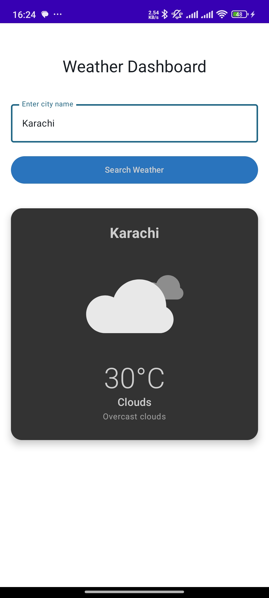

# 🌦 Mini Weather Dashboard App

A modern Android weather application built with **Jetpack Compose** and **MVVM architecture** that provides real-time weather information with beautiful **Lottie animations**.

---

## ✨ Key Features

- 📡 **Weather Data** — Fetches current weather using the [OpenWeatherMap API](https://openweathermap.org/api)
- 🎬 **Animated UI** — Dynamic Lottie animations that change based on weather conditions (☀ sunny, 🌧 rainy, ☁ cloudy, ❄ snowy, etc.)
- 🏗 **Modern Architecture** — Clean MVVM pattern with Repository, ViewModel, and StateFlow
- 💾 **Persistent Storage** — Remembers last searched city using **DataStore**
- 🚦 **Error Handling** — Comprehensive error states for network failures and invalid cities
- 📱 **Responsive Design** — Material 3 design with loading states and smooth animations

---

## 🛠 Technical Stack

- **Kotlin** with **Jetpack Compose** for modern declarative UI
- **Hilt** for dependency injection
- **Retrofit** for API calls + **Coroutines** for async operations
- **Lottie** for weather animations
- **DataStore** for local persistence

---

## 📷 Screenshots


---

## 🚀 How to Run the App

### 1️⃣ Clone the Repository
```bash
git clone https://github.com/your-username/mini-weather-dashboard.git
cd mini-weather-dashboard
```
Build & Run
Select a device/emulator

Click ▶ Run in Android Studio